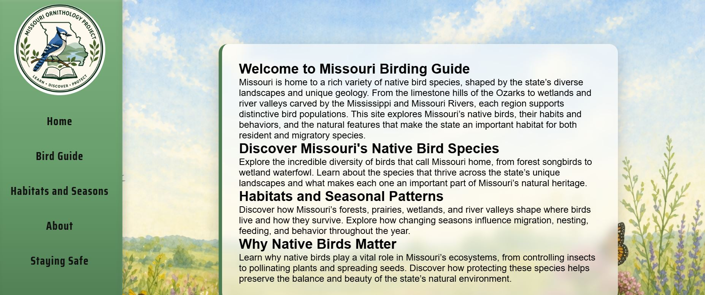
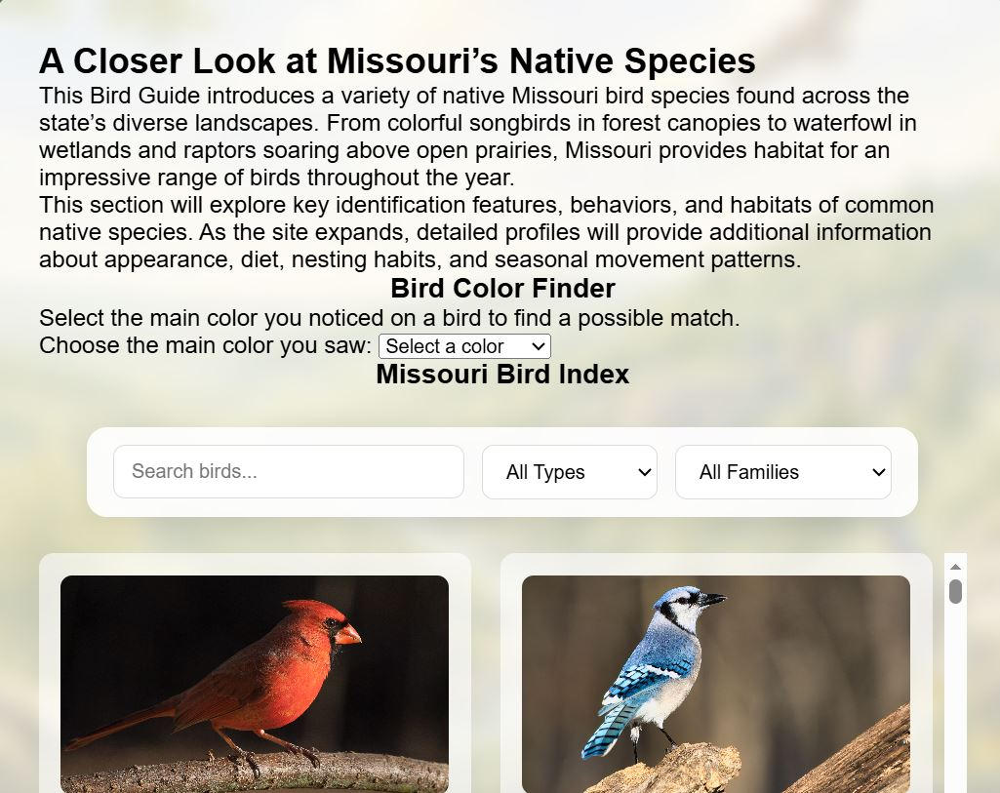

# Missouri Ornithology Project


An interactive educational website that introduces users to Missouri bird species while demonstrating modern front-end web development techniques, responsive design, and JavaScript interactivity.

---

## Overview

The Missouri Ornithology Project is an educational website created to showcase information about Missouri bird species through an engaging and user-friendly interface. The project was developed to strengthen my front-end web development skills while building a practical website that combines educational content with interactive features.

In addition to bird information, the website includes a page dedicated to staying safe while exploring bird-related websites, demonstrating an understanding of both web development and internet safety.

---

## Why I Built This

I built this project to gain hands-on experience creating a complete multi-page website using HTML, CSS, and JavaScript.

Throughout development, I practiced organizing a larger website, creating intuitive navigation, designing responsive layouts, and implementing interactive features that improve the overall user experience.

---

## Features

| Feature | Description |
|----------|-------------|
| Multi-Page Website | Organized pages with consistent navigation |
| Educational Content | Information about Missouri bird species |
| Interactive JavaScript | Dynamic website functionality |
| Responsive Design | Optimized for desktop and mobile devices |
| Web Safety Page | Tips for safely exploring bird-related websites |
| User-Friendly Navigation | Easy access to all sections of the website |

---

## Technologies Used

- HTML5
- CSS3
- JavaScript
- Git
- GitHub
- GitHub Pages

---

## Concepts Demonstrated

- Responsive Web Design
- DOM Manipulation
- Event Handling
- Website Navigation
- User Interface Design
- Front-End Development
- Educational Website Design
- Version Control with Git

---

## Live Demo

Visit the live website:

**https://breannaruckle.github.io/Missouri-Ornithology-Project/**

---

## How to Run

### Option 1 (Recommended)

Visit the live GitHub Pages site:

https://breannaruckle.github.io/Missouri-Ornithology-Project/

### Option 2

1. Clone this repository.
2. Open the project folder.
3. Open `index.html` in your preferred web browser.

---

## Screenshots

### Home Page



---

### Bird Information




## Project Structure

```text
Missouri-Ornithology-Project/
│
├── css/
├── images/
├── js/
├── screenshots/
│   ├── home.png
│   ├── birds.png
│   └── safety.png
├── index.html
├── README.md
└── LICENSE
```

---

## Future Enhancements

- Add additional Missouri bird species
- Implement search and filtering functionality
- Include bird calls and audio recordings
- Add interactive quizzes
- Expand educational resources
- Improve accessibility features
- Enhance mobile responsiveness

---

## Author

**Breanna Ruckle**

Computer Information Systems Student  
Cybersecurity Focus

GitHub: https://github.com/breannaruckle

---

## License

This project is licensed under the MIT License. See the `LICENSE` file for details.
